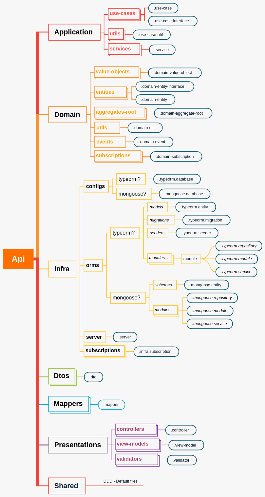
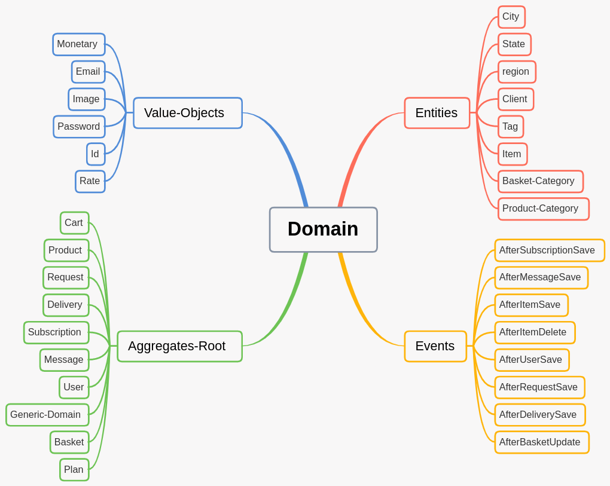
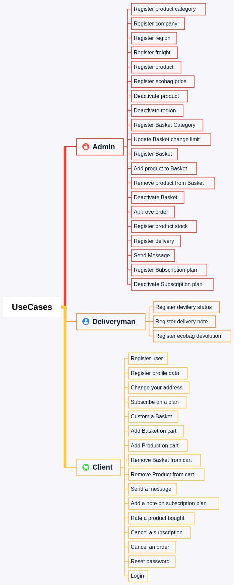
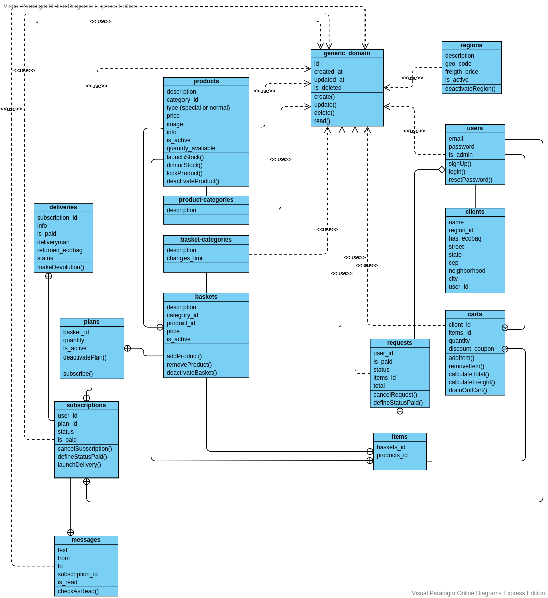

# Projeto e-commerce

### Projeto com DDD, SOLID, TDD, CLEAN CODE e POO

#### Resumo

Uma aplicação para comercialização de produtos orgânicos.
O sistema deve permitir cadastro e gestão de produtos orgânigos,
os produtos devem ser categorizados.

Também deve ser possível cadastrar cestas com diversos produtos cadastrados.
As cestas também devem ser categorizadas.
Cada cesta cadastrada deve ter um limite de alterações permitidas, de acordo
com sua categoria.

O limite de alteração não é a única regra para personalização da cesta.
Cada produto possui um peso de alteração, e as substituições devem
seguir o peso para bloquear novas alterações, exemplo:
Se o usuário retira um produto com peso 3, e atinge o limite de alteração
da cesta em questão, o sistema deve permitir o usuário a adicionar mais 3
produtos com peso 1 ou adicionar mais 1 produto com peso 3 ou mais 1 produto
com peso 2 e outro com peso 1, até que o peso total seja atingido.

O usuário deve se cadastrar apenas com email e senha.
O usuário só pode personalizar uma cesta se estiver devidamente cadastrado na plataforma.
Além das cestas o usuário pode adicionar produtos avulsos ao carrinho, desde
que estes produtos sejam do tipo especial.

O usuário cadastrado pode acessar o seu painel de pedidos e a qualquer momento
cancelar um pedido que esteja com o status aberto.
Também pode realizar uma assinatura de acordo com os planos disponíveis.

O usuário pode rastrear os seus pedidos, bem como trocar mensagens em seus planos
de assinatura, tais mensagens ficam vinculadas à sua assinatura e é visualizada pelo admin.

O sistema deve limitar os pedidos para apenas clientes que moram nas regiões cadastradas.
Cada região pode possuir um frete diferenciado.

Ao concluir um novo pedido o sistema deve realizar a baixa de estoque.

Assinaturas devem agendar baixas de estoque. Assim que lançado estoque a baixa dos
produtos devem ocorrer automaticamente.

Os clientes assinantes podem a qualquer momento personalizar suas cestas da semana.

O admin pode aprovar ou reprovar qualquer pedido.

O sistema deve aceitar pagamentos em cartão de crédito ou boleto via PayPal.

Cada pedido é enviado com uma ecobag retornável, o sistema deve realizar o rastreamento
das mesmas e indicar se um cliente realizou a devolução ou não.

#### Modelagem do sistema

##### Arquitetura da aplicação

---

##### Mapa de artefatos da aplicação

---

##### Casos de uso

---

##### Diagrama de classe

---

##### Como usar esse projeto

---

- `$ git clone https://github.com/ALESSANDROLMENEZES/e-commerce.git`

- `$ cd e-commerce `

- `$ yarn `

- `$ yarn run start `
